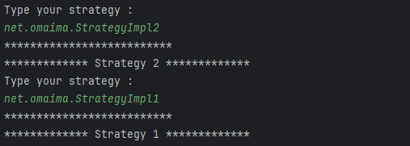
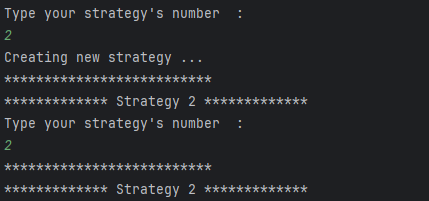

# Strategy Pattern in Java

## How It Works

The Strategy pattern allows a program to use different algorithms or behaviours through a common interface. Each strategy is implemented in a separate class, making the code easier to maintain and extend.

In this example:
- `StrategyImpl1` , `StrategyImpl2` and  `StrategyImpl3` are concrete strategy implementations.
- The program displays the available strategies and their class names.
- The user enters a number to select a strategy.
- Java reflection is used to create the selected strategy dynamically.
- Existing strategy instances can be reused instead of creating a new instance every time.

## Console Output

### 1. Available Strategies

The program displays the available strategy implementations.

### 2. Selecting a Strategy

The user enters `2` to select Strategy 2.

### 3. Creating and Reusing a Strategy

When Strategy 2 is selected for the first time, the program displays `Creating new strategy ...`. When it is selected again, the existing instance is reused.

## Key Concepts

- **Encapsulation:** Each strategy contains its own implementation.
- **Loose coupling:** The code works with a common interface instead of depending directly on concrete implementations.
- **Extensibility:** New strategies can be added without changing the existing strategy implementations.

